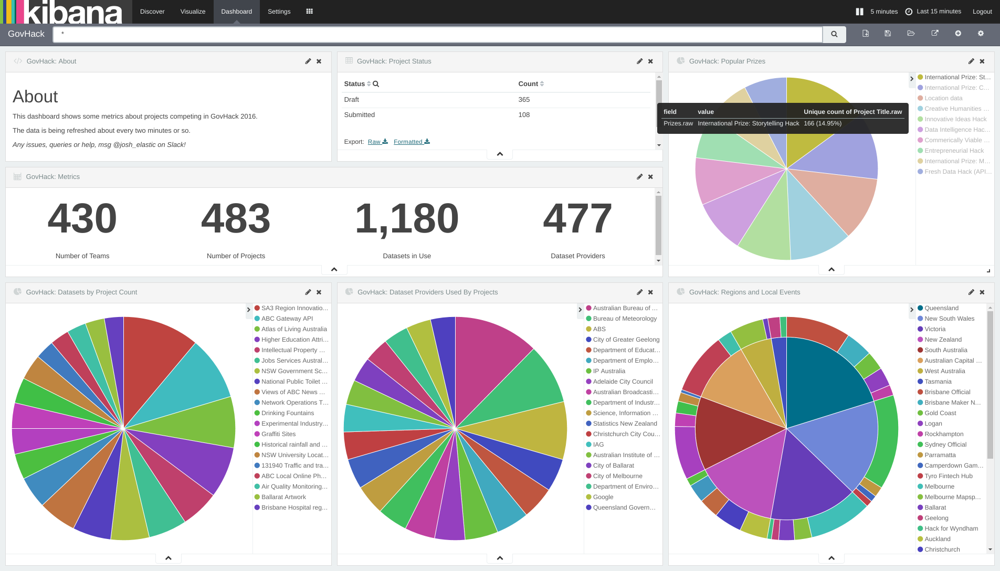

# About

This repo contains instructions, configuration files and scripts that
will allow you to create a dashboard of the GovHack competition data
for teams, projects, regions, prizes etc.

# Requirements

* Bash
* Curl
* [CSVkit](https://github.com/wireservice/csvkit)
* [Elasticsearch](https://elastic.co/products/elasticsearch)
* [Logstash](https://elastic.co/products/logstash)
* [Kibana](https://elastic.co/products/logstas)

# How it works

The basic process is:

1. CSV export of GovHack Projects is downloaded (by bash script)
2. CSV is converted to JSON with CSVkit (by bash script)
3. JSON is read by Logstash, some processing performed and indexed
   into Elasticsearch

After that, the data is available in Elasticsearch and can be viewed
in Kibana.

# Setting it up

## Start Elasticsearch

First, you need an Elasticsearch cluster running some where.  It's
sufficient for the cluster to be a single Elasticsearch instance.  The
dataset is super-small, so even a micro instance (which are usually
free) on most cloud providers will be more than sufficient.

For more details on downloading, installing and running Elasticsearch,
see the
[official documentation](https://www.elastic.co/guide/en/elasticsearch/reference/2.3/_installation.html)

## Edit the Logstash config

Edit the Logstash config and change the `<somehost>:<someport>` to the
hostname and port on which Elasticsearch is running.  If you just
started Elasticsearch up on your own machine, this will be `localhost:9200`.

## Run the Bash script

The Bash script will downloaded the data, convert it and run Logstash
to index the data into Elasticsearch.  It's commented, so
[check it out](govhack.sh) to see how it works.  It will keep running
by simply sleeping and then re-exec'ing itself.  So once you start it
up, you're done!

## Start Kibana and import dashboards

Finally, you'll need to start up Kibana so you can view the pretty
visualisations. Follow the
[official documentation](https://www.elastic.co/guide/en/kibana/4.5/setup.html#explore). When
setting an index pattern, use `logstash-govhack-projects` and don't
select the **Index contains time-based events** checkbox.  _Note that
you could essentially just use the default index pattern and leave the
box checked, which will work, but if you start adding new indices and
other data, you may run into trouble._

Now, you'll want to import the existing dashboards and
visualisations.  See the last set of steps
[here](https://www.elastic.co/guide/en/kibana/4.5/managing-saved-objects.html).
Import the files in the [kibana](kibana) directory.  there are three
files there, for the saved search, the visualisations and the
dashboard.  Import all three.

## Marvel in the glorious data visualisations

At this point, data should be flowing into Elasticsearch and you
should be able to fire up your web browser, navigate to your Kibana
instance and open the **GovHack** dashboard and view the lovely data.
